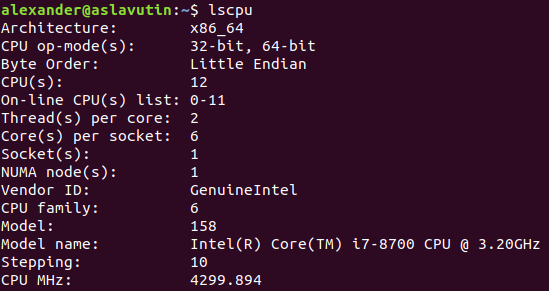

# Max-Clique-Cplex-Python


### Requirements
 - Install Cplex for Python
 - Python >= 3.6
 - pip install -r requirements.txt

### Evaluation on subset of DIMACS graphs
```bash
usage: max_clique_bnb_evaluator.py [-h] [--input_data_file INPUT_DATA_FILE]
                                   [--output_results_dump OUTPUT_RESULTS_DUMP]

optional arguments:
  -h, --help            show this help message and exit
  --input_data_file INPUT_DATA_FILE
                        path to file with input benchmarks data
  --output_results_dump OUTPUT_RESULTS_DUMP
                        path to output file

```

The sample of input data file.

```text
GraphName,CorrectMaxClique,Level
johnson8-2-4.clq,4,E
```

### Machine Characteristics Info
All graphs were evaluated on the machine with the following characteristics:

**RAM** - 64GB




## Evaluation Results

### Easy graphs

|Graph Name   |Correct Max Clique|Graph Complexity|Found Max Clique|Is Clique|Consumed Time(seconds)|
|-------------|------------------|----------------|----------------|---------|-------------|
|johnson8-2-4 |4                 |E               |4               |True     |0.244        |
|johnson16-2-4|8                 |E               |8               |True     |41.034       |
|MANN_a9      |16                |E               |16              |True     |1.128        |
|keller4      |11                |E               |11              |True     |175.136      |
|hamming8-4   |16                |E               |16              |True     |37.038       |

### Meduim graphs

...(Will be updated)
